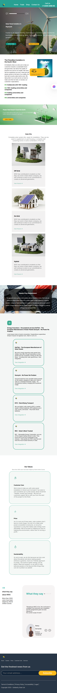

# 🌞 Solar Landing Page

A responsive landing page built using **HTML5**, **CSS3**, and **Media Queries**, based on a UI design created in **Figma**.

## 🚀 Live Demo
[Click here to view the live site]([https://yourusername.github.io/your-repo-name](https://mohamed-0cs.github.io/Solar-Landing-Page-Responsive-Design-/))

## 🖼️ Figma Design
[View the original Figma template](https://www.figma.com/design/xlESOD0VgwJNtIIe35nQ9Y/Landing-page-for-Solar-comapny--Community-?node-id=0-1&p=f)

## 🛠️ Tech Stack
- HTML5
- CSS3
- Media Queries (Responsive Design)
- Figma (Design Reference)

## 📱 Responsive Design
The layout is fully responsive and adapts seamlessly to:
- ✅ Desktop
- ✅ Tablet
- ✅ Mobile screens

## 📸 Screenshots

## ✨ Features
- Hero section with CTA
- Clean, accessible layout
- Mobile-first responsive design
- Fully based on a Figma design

## 📁 Folder Structure

Solar-Landing-Page-Responsive-Design-/
├── index.html
├── css/
│   └── style.css
├── img/
│   └── [images here]
├── screenshots/
│   ├── desktop.png
│   └── mobile.png

## 🧑‍💻 Author
Mohamed Masoud Raafat  
[GitHub Profile]([https://github.com/yourusername](https://github.com/Mohamed-0cs))

---

## 📌 Notes
This project was created as part of my front-end learning journey. It’s a static, responsive landing page built from a Figma template using only HTML and CSS.
